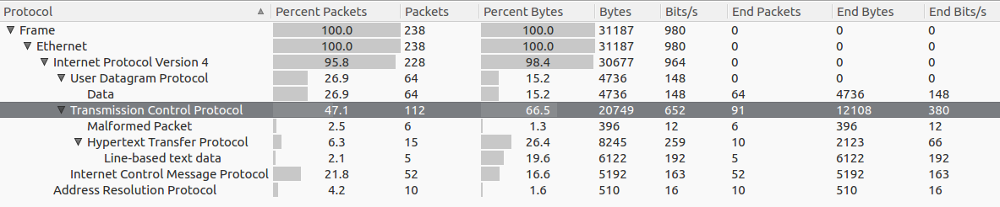
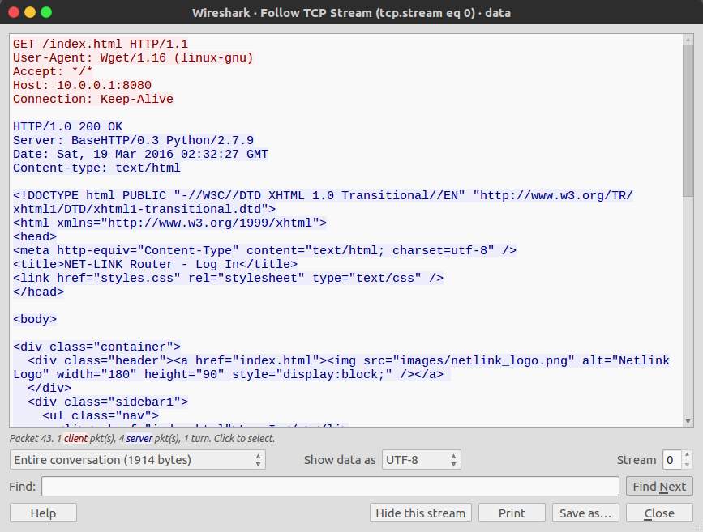
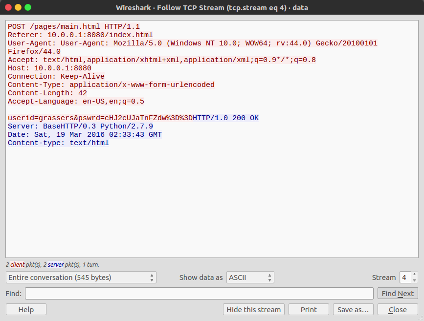

<!-- This markdown file is writeup template. -->

## Digital Camouflage 50pt

### Problem
> We need to gain access to some routers. Let's try and see if we can find the password in the captured network data: [data.pcap](https://webshell2017.picoctf.com/static/397988433a8cbcf971b989ac6eaae153/data.pcap).

### Answer
Check **data.pcap** in WireShark.  
We used the statistical function to overlook the whole image, since the number of packets is large.    



Looking at the TCP Stream in wireshark (`Analyze -> Follow -> TCP Stream`), we see that someone accessed a router's login page. 



Looking at the login page's source code, we found `password == pswrd`. Password is encoded by [base64](https://tools.ietf.org/html/rfc4648) with the use of [Javascript](https://developer.mozilla.org/en-US/docs/Web/API/WindowBase64/Base64_encoding_and_decoding). And [percent-encoding](https://tools.ietf.org/html/rfc3986#section-2.1) is used, too.

```html
  <div class="content">
    <h1>Log In </h1>
    <form name="login" class="contentstuff" method="post" action="pages/main.html" onsubmit="modifyPass()">
    <table>
    	<tr>
        	<td>Username</td>
            <td><input type="text" name="userid"/></td>
        </tr>
        <tr>
        	<td>Password</td>
            <td><input type="password" name="pswrd"/></td>
        </tr>
    </table>

    <button type="submit">Submit</button>
	<input type="reset" value="Cancel"/>
    </form>
    
    <script>
		function modifyPass(){
			document.login.pswrd.value = btoa(document.login.pswrd.value);
		}
	</script>
```

In `tcp.strem eq 4`, someone POST `userid` and `pswrd` to router.  

  

Let's decode it!!!

```bash
$ echo 'cHJ2cUJaTnFZdw%3D%3D' | nkf --url-input
cHJ2cUJaTnFZdw==
echo 'cHJ2cUJaTnFZdw==' | base64 -d
prvqBZNqYw
```

Yay, flag is found :)

### Flag
prvqBZNqYw
