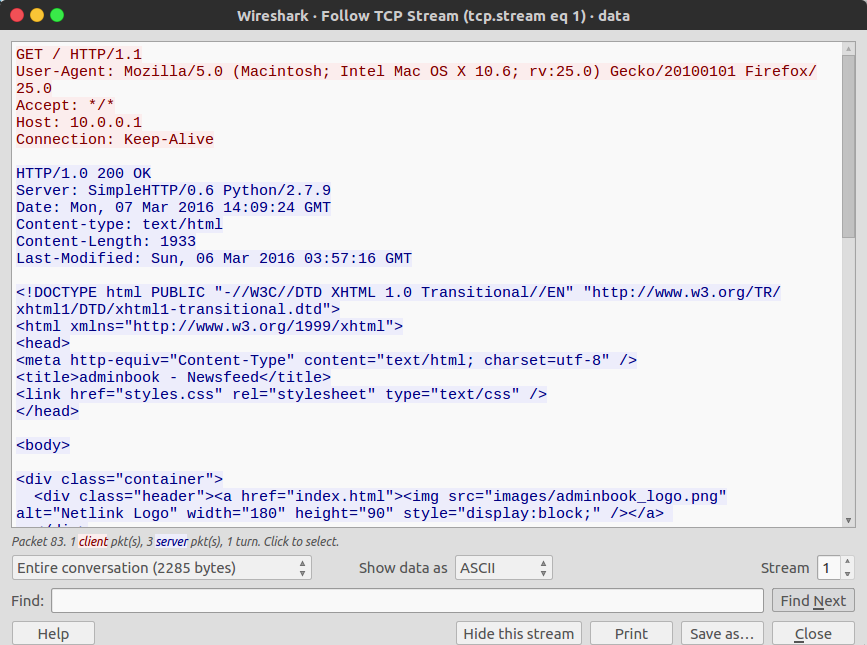

<!-- This markdown file is writeup template. -->

## Special Agent User 50pt

### Problem
> We can get into the Administrator's computer with a browser exploit. But first, we need to figure out what browser they're using. Perhaps this information is located in a network packet capture we took: [data.pcap](https://webshell2017.picoctf.com/static/2f9040c85f6b95c0b036fd3561eee081/data.pcap). Enter the browser and version as "BrowserName BrowserVersion". NOTE: We're just looking for up to 3 levels of subversions for the browser version (ie. Version 1.2.3 for Version 1.2.3.4) and ignore any 0th subversions (ie. 1.2 for 1.2.0)

### Answer
Check **data.pcap** in WireShark. Looking at the TCP Stream in wireshark (`Analyze -> Follow -> TCP Stream`), computer information is located in HTTP Request header. See `tcp.stream eq 1`.

Flag is here. `User-Agent: Mozilla/5.0 (Macintosh; Intel Mac OS X 10.6; rv:25.0) Gecko/20100101 Firefox/25.0`.

### Flag
Firefox 25.0
