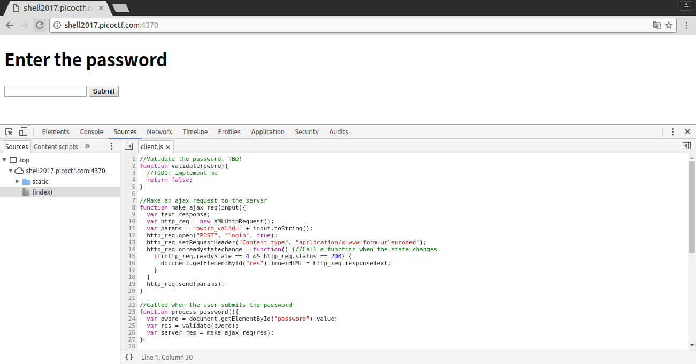
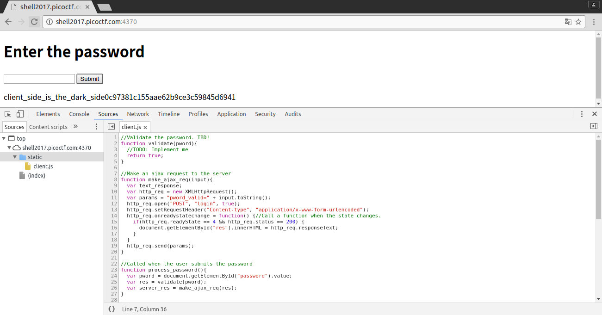

[](
  This markdown file is writeup template.
)
## Lazy Dev 50pt

### Problem
> I really need to login to this [website](http://shell2017.picoctf.com:4370/), but the developer hasn't implemented login yet. Can you help?

### Answer
Accessed to website, we used developer-tools (`F12`) to check the source.



Modify the script as follows.
`TBD` is `To Be Determined`.

```javascript
//Validate the password. TBD!
function validate(pword){
  //TODO: Implement me
  return true;
}
```

Save the script and click `submit`. Flag will appear !!!



### Flag
client_side_is_the_dark_side0c97381c155aae62b9ce3c59845d6941
