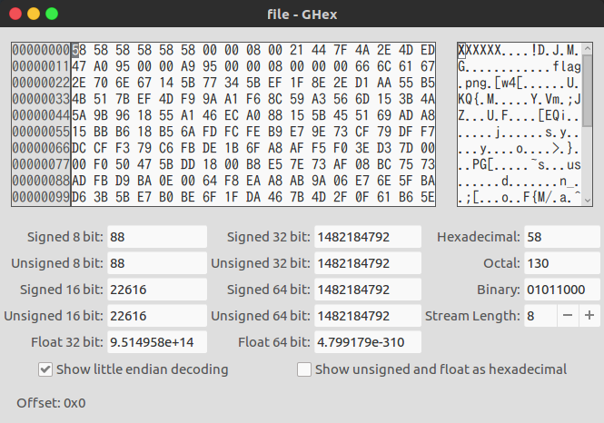
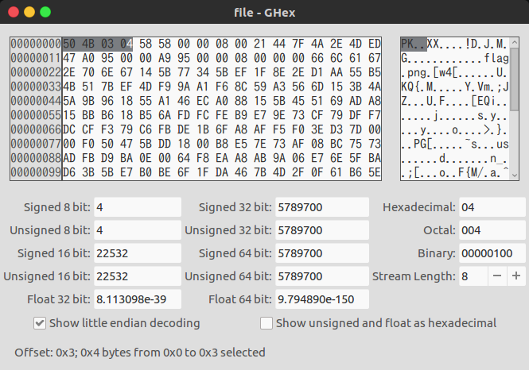

<!-- This markdown file is writeup template. -->

## Missing Identity 100pt

### Problem
> Turns out, some of the files back from Master Challenge 1 were corrupted. Restore this one [file](https://webshell2017.picoctf.com/static/2b92f792615f667179c849b8f69c4a0b/file) and find the flag. Update 16:26 EST 1 Apr If you feel that you are close, make a private piazza post with what you have, and an admin will help out. The flag starts with the character z.

### Answer
Examine what the `file` is.

```bash
$ file file
file: data
```

Damn it. Let's see the Hints.

> - What file is this?
> - What do you expect to find in the file structure?
> - All characters in the file are lower case or numberical. There will not be any zeros.

OK, it's a compressed file given, so check the contents.

```bash
$ binwalk file

DECIMAL       HEXADECIMAL     DESCRIPTION
--------------------------------------------------------------------------------
38342         0x95C6          Zip archive data, at least v2.0 to extract, compressed size: 51179, uncompressed size: 51159, name: nottheflag1.png
89566         0x15DDE         Zip archive data, at least v2.0 to extract, compressed size: 64048, uncompressed size: 64071, name: nottheflag2.png
153659        0x2583B         Zip archive data, at least v2.0 to extract, compressed size: 58674, uncompressed size: 58654, name: nottheflag3.png
212378        0x33D9A         Zip archive data, at least v2.0 to extract, compressed size: 65848, uncompressed size: 65828, name: nottheflag4.png
278271        0x43EFF         Zip archive data, at least v2.0 to extract, compressed size: 63117, uncompressed size: 63097, name: nottheflag5.png
341433        0x535B9         Zip archive data, at least v2.0 to extract, compressed size: 45718, uncompressed size: 45703, name: nottheflag6.png
387196        0x5E87C         Zip archive data, at least v2.0 to extract, compressed size: 62476, uncompressed size: 62456, name: nottheflag7.png
450198        0x6DE96         End of Zip archive, footer length: 22
$ unzip -l file
Archive:  file
  Length      Date    Time    Name
---------  ---------- -----   ----
    38313  2017-03-31 08:33   flag.png
    51159  2017-03-31 08:33   nottheflag1.png
    64071  2017-03-31 08:33   nottheflag2.png
    58654  2017-03-31 08:33   nottheflag3.png
    65828  2017-03-31 08:33   nottheflag4.png
    63097  2017-03-31 08:33   nottheflag5.png
    45703  2017-03-31 08:33   nottheflag6.png
    62456  2017-03-31 08:33   nottheflag7.png
---------                  )  -------
   449281                     8 files
$ unzip -d unzip_file file
Archive:  file
file #1:  bad zipfile offset (local header sig):  0
  inflating: unzip_file/nottheflag1.png  
  inflating: unzip_file/nottheflag2.png  
  inflating: unzip_file/nottheflag3.png  
  inflating: unzip_file/nottheflag4.png  
  inflating: unzip_file/nottheflag5.png  
  inflating: unzip_file/nottheflag6.png  
  inflating: unzip_file/nottheflag7.png  
```

Fortunately, using `unzip -l`, we found the flag. However, the flag has not been decompressed. So check `file` using `xxd` command to find promlems.

```bash
$ xxd file > output
```
Looking at the [output](output), there is evidence that file signatures (known as [magic number](http://www.astro.keele.ac.uk/oldusers/rno/Computing/File_magic.html)) has been tampered with. Let's try to repair it using binary editor (`58 58 58 58 58` --> `50 4B 03 04`).




```bash
$ unzip -d unzip_flag file
Archive:  file
  inflating: unzip_flag/flag.png     
  inflating: unzip_flag/nottheflag1.png  
  inflating: unzip_flag/nottheflag2.png  
  inflating: unzip_flag/nottheflag3.png  
  inflating: unzip_flag/nottheflag4.png  
  inflating: unzip_flag/nottheflag5.png  
  inflating: unzip_flag/nottheflag6.png  
  inflating: unzip_flag/nottheflag7.png  
```
### Flag

