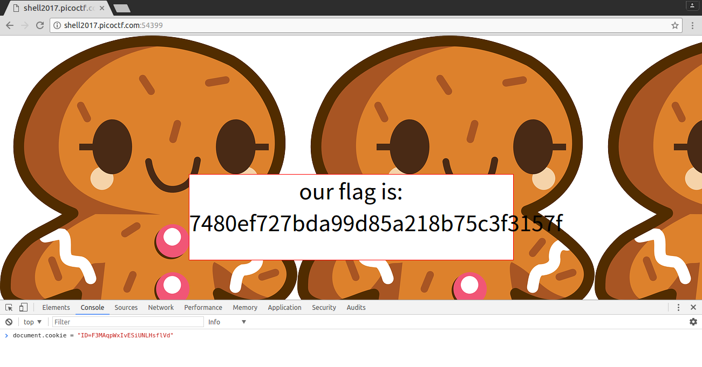

<!-- This markdown file is writeup template. -->

## Biscuit 75pt

### Problem
> Your friend has a personal website. Fortunately for you, he is a bit of a noob when it comes to hosting a website. Can you find out what he is hiding? [Website](http://shell2017.picoctf.com:54399/).

### Answer
Let's access the website and view the source. I found that `cookies.sqlite` is hidden in `private`. In addition, a hint for accessing it is described in the style tag.

```html
<!-- Storing stuff in the same directory as your web server doesn't seem like a good idea -->
<!-- Thankfully, we use a hidden one that is super PRIVATE, to protect our cookies.sqlite file -->
<style>
body{
	background-image: url("private/image.png");
}
</style>
```

By downloading `private/cookies.sqlite`, let's try and extract the cookies from the file.


```sql
$ sqlite3 cookies.sqlite
SQLite version 3.11.0 2016-02-15 17:29:24
Enter ".help" for usage hints.
sqlite> SELECT * FROM sqlite_master WHERE type='table';
table|moz_cookies|moz_cookies|2|CREATE TABLE moz_cookies (id INTEGER PRIMARY KEY, baseDomain TEXT, appId INTEGER DEFAULT 0, inBrowserElement INTEGER DEFAULT 0, name TEXT, value TEXT, host TEXT, path TEXT, expiry INTEGER, lastAccessed INTEGER, creationTime INTEGER, isSecure INTEGER, isHttpOnly INTEGER, CONSTRAINT moz_uniqueid UNIQUE (name, host, path, appId, inBrowserElement))
sqlite> SELECT * FROM moz_cookies;
1|localhost|0|0|ID|F3MAqpWxIvESiUNLHsflVd|localhost|/|1489365457|1489279130600290|1489279057101857|0|0
sqlite> .quit
```

Using Javascript to edit document.cookie, we get the flag :)

```
> document.cookie = "ID=F3MAqpWxIvESiUNLHsflVd"
```



### Flag
7480ef727bda99d85a218b75c3f3157f
